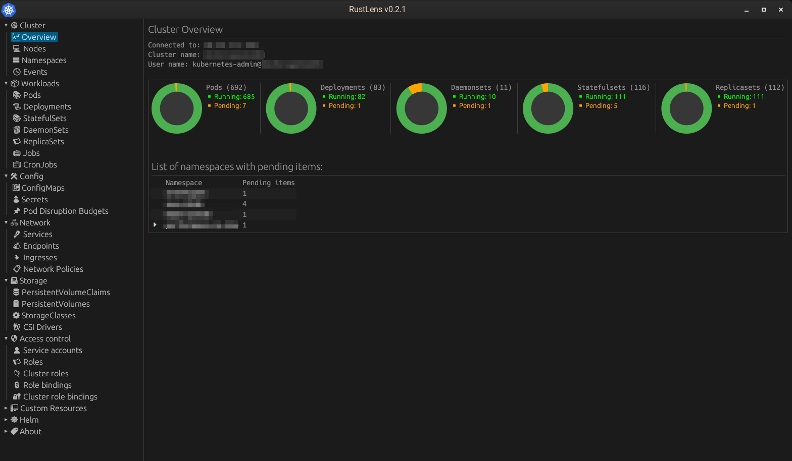
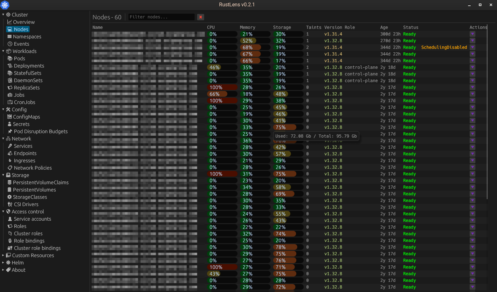
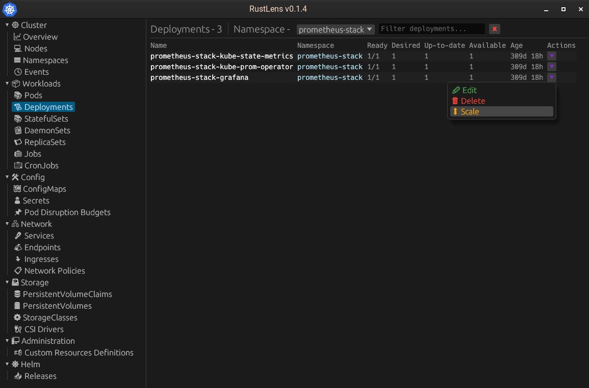
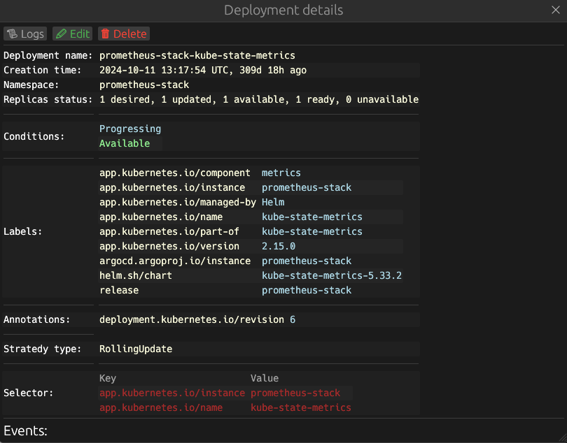

# Rustlens
Project in a progress!

[](https://github.com/denix666/rustlens)
[](https://github.com/denix666/rustlens/releases)
[](https://opensource.org/licenses/MIT)

A powerful and intuitive ui tool for managing your Kubernetes (k8s) cluster. This program allows you to seamlessly interact with your cluster resources, streamlining your development and deployment workflows.

---

## Features

* **View Resources:** List nodes, pods, services, and deployments across all namespaces.
* **Inspect Resources:** Get detailed descriptions of specific cluster resources (`describe`).
* **Manage Pods:** View real-time logs from any running pod.
* **Control Deployments:** Scale your deployments up or down.
* And much more!

---

## Prerequisites

For a successful connection to your Kubernetes cluster, you must have a valid configuration file.

* **Configuration File:** The program requires a file named `.config` to be present in your home directory.
    * On **macOS/Linux**, this path is `~/kube/.config`
    * On **Windows**, this path is `%USERPROFILE%\kube\.config`

Please ensure your cluster connection details are correctly specified in this file.

There are plans in the future to implement multicluster connection.

---

## Build from source

1.  **Clone the repository:**
    ```bash
    git clone https://github.com/denix666/rustlens.git
    ```

2.  **Navigate to the project directory:**
    ```bash
    cd rustlens
    ```

3.  **Build the application:**
    ```bash
    cargo build --release
    ```
---

## Cross-Platform Compatibility
This application is designed to be cross-platform and should run on both Windows and macOS. However, please note that it has not yet been formally tested on these platforms. We appreciate any feedback on its performance in these environments.

---

# Screenshots

## Overview


## Nodes


## Namespaces


## Deployment


## Deployment details


## Contributing
Contributions are welcome! Please feel free to open an issue or submit a pull request.

## License
[MIT License](https://opensource.org/licenses/MIT)
