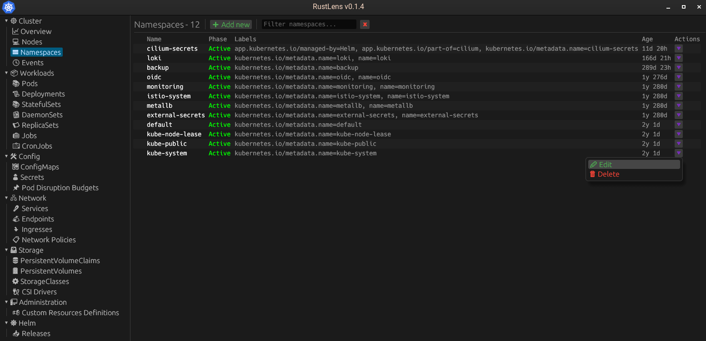

# Rustlens
Project in a progress!

It's a free and open-source user interface designed for managing Kubernetes clusters

## Nodes

## Namespaces

## Deployment

## Deployment details

## Contributing
Anyone is welcome to collaborate to advance the Rustlens project.

## License
[MIT License](https://opensource.org/licenses/MIT)
